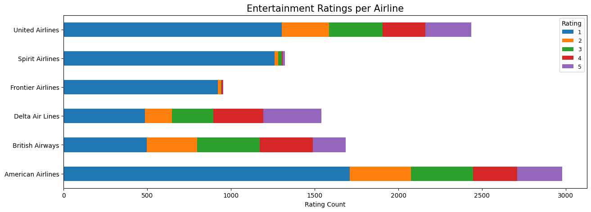
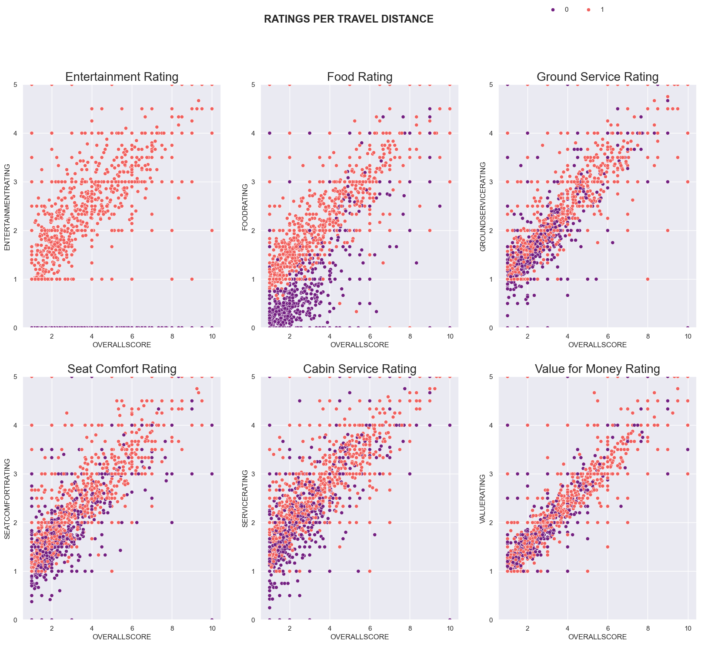
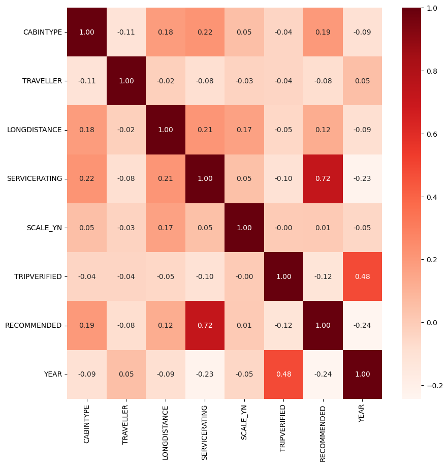
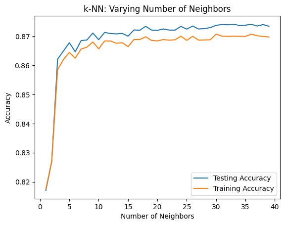
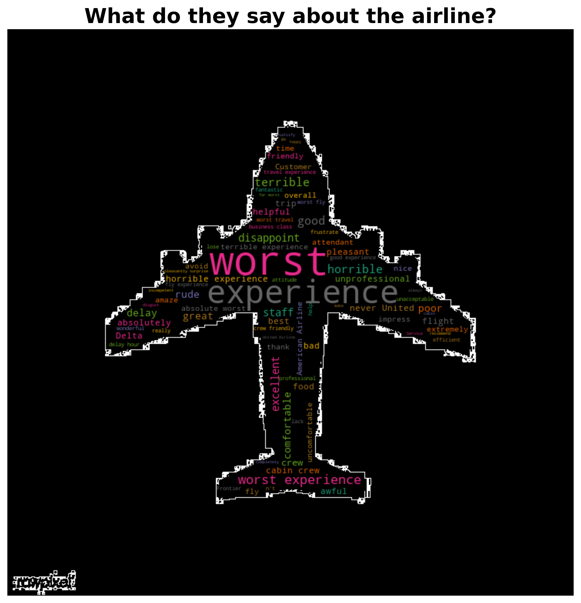

# Airlines Analyser


* Ready for those amazing holidays you were planning and waiting so much? 
* Maybe waiting for an important business trip that will boost your career? 
* Planning a fairy tale getaway with your couple for a magic proposal?

When looking for a flight most people look for prices or times. 
However, many other items are key to get a wonderful or a nigthmare flight experience. 

In 'Flight Judge' we believe in altruism and social justice. Hence we have designed a place were travellers can express their opinions about their flight experiences.
You can also rate your onw flight and help future travellers! 

Link to the app: https://flight-judge.streamlit.app/


## *Content*

- Data Sources

- Exploratory Data Analysis

- Descriptive Statistics

- Models


## *Objective and Data Sources*

**Objective**: analysis of real airlines based on reviews & other data provided by previous customers.

**Data Source**: ‘128k Airline Reviews’ (https://www.kaggle.com/datasets/joelljungstrom/128k-airline-reviews). 

**Initial Dataset**: 129,454 rows & 22 columns with the following variables:

- Aircraft
- Airline
- Cabin Type (Economy, Premium Economy, Business, First Class)
- Dates  (trip, publication)
- Ratings (Entertainment, Cabin service, Ground service, Food, Wi-Fi, Seat comfort, Value for money) 
- Geographic variables: Origin Country, Route
- Overall Score: Total score (0-10) of the trip
- Recommended
- Review (title, body)
- Travel Type (Solo, Couple, Family + Business, Leisure)
- Trip Verification

## *Exploratory Data Analysis*
Data was explored in detail by checking the typology, missingness and unique values of each variable.

Data cleaning consisted on renaming variables, replacing unclear values and dropping duplicates or inconsistent data (e.g. negative dates). Treatment of missingness was applied using the 3% rule. Variables with more than 3% missingness were not considered in the analysis or dropped the rows with missing values (still, enough data to consider the analysis robust).

Additional variables were created to enrich the analysis:

- **Travel Type**: was separated in two different variables i.e. traveler (solo, couple, family) & purpose (leisure, business);

- **Route**: converted to three different variables (origin/destiny/scale (yes/no)) using regex;

- **Entertainment Rating**: if entertainment rating>0, flight was considered a long distance flight.

- **Origin Country**: Continent was obtained from this variable.

- **Trip Date**: Year was extraced from this variable.

After this,  a clean database of 90,000 rows and 27 columns was obtained. Here many airlines were included, but most of them had few observations. As a result, the main analysis was conducted with the most reviewed airlines (2k+ reviews). This resulted in a database of 20,366 rows and 27 columns including 6 airlines out of 547:


<div>
<style scoped>
    .dataframe tbody tr th:only-of-type {
        vertical-align: middle;
    }

    .dataframe tbody tr th {
        vertical-align: top;
    }

    .dataframe thead th {
        text-align: right;
    }
</style>
<table border="1" class="dataframe">
  <thead>
    <tr style="text-align: right;">
      <th></th>
      <th>AIRLINENAME</th>
      <th>REVIEW_COUNT</th>
    </tr>
  </thead>
  <tbody>
    <tr>
      <th>80</th>
      <td>American Airlines</td>
      <td>4912</td>
    </tr>
    <tr>
      <th>126</th>
      <td>British Airways</td>
      <td>2723</td>
    </tr>
    <tr>
      <th>164</th>
      <td>Delta Air Lines</td>
      <td>2338</td>
    </tr>
    <tr>
      <th>200</th>
      <td>Frontier Airlines</td>
      <td>2700</td>
    </tr>
    <tr>
      <th>410</th>
      <td>Spirit Airlines</td>
      <td>3972</td>
    </tr>
    <tr>
      <th>468</th>
      <td>United Airlines</td>
      <td>3721</td>
    </tr>
  </tbody>
</table>
</div>


Data was assessed more specifically using graphs. Most travelers valued negatively each of the different ratings included in the review. Regarding entertainment, Spirit and Frontier are the less valued:



In terms of staff, most Airlines have a poor staff service. Ground service is worse than Cabin Service in all Airlines and British Airways is the best valued while American, United & Spirit are the worst valued in this rating.


Regarding seating, no Airline is considered to have comfortable seats. American Airlines and British Airways stand as the most valued. Frontier is the most penalized. 


The type of travel and the purpose of travel were also assessed. Most people travelled alone and in business class this was always the case. Travelling with couple/family was always for leisure.


The relationship between the overallscore and the ratings was also assessed differentiating by the trip distance. Food and staff service were better and more common in long distance flights.



In terms of trip verification, many trips were not verified. Specially in British Airways and Spirit Airlines, which reviews should be carefully considered.


Also, the overall score of the flight over time was analysed by airline. There is a tendency to decrease the passenger satisfaction with time:


Not only real data was considered, but also a prediction of how would the overall score of a flight behave in future reviews was performed. Data was narrowed only to take the last year of available data (2023) in order to get readable results. The analysis was performed using LSTM (Long short-term memory) neural network. Here is an example of the prediction of the overall score for American Airlines, were a decreasing tendency can be perceived:


## *What does influence a flight to be (positively) recommended?*

To answer this question, classification models were employed. First, a Logistic Regression (Logit Model) was performed. Independent variables considered were cabin, traveler, purpose, ratings, long distance, verified, scale, year.

A crosstab for each variable was performed to check the correlation between them. This showed a strong multicollinearity between data. As a result, most ratings were dropped except cabin service to be assumed specially relevant in a positive recommendation. Variable year was also dropped to its strong correlation showed by the correlation matrix and the VIF.




The dependant variable was quite imbalanced so upsampling techniques (SMOTE) were also used to balance it.

Results show a ROC curve over 80%, so the variables explained quite well the dependant variable ('RECOMMENDED'):

```Python
              precision    recall  f1-score   support

           0       0.92      0.89      0.90     47377
           1       0.80      0.85      0.82     24630

    accuracy                           0.87     72007
   macro avg       0.86      0.87      0.86     72007
weighted avg       0.88      0.87      0.87     72007

```


Coefficients of the model show that while the cabin staff rating and the luxury of the seat influence positively a recommendation, the fact that there is a scale, a long distance flight, travelling with the family or the fact that the trip was verified cause the opposite effect:

<div>
<style scoped>
    .dataframe tbody tr th:only-of-type {
        vertical-align: middle;
    }

    .dataframe tbody tr th {
        vertical-align: top;
    }

    .dataframe thead th {
        text-align: right;
    }
</style>
<table border="1" class="dataframe">
  <thead>
    <tr style="text-align: right;">
      <th></th>
      <th>Names</th>
      <th>Coefficients</th>
    </tr>
  </thead>
  <tbody>
    <tr>
      <th>0</th>
      <td>CABINTYPE</td>
      <td>0.180474</td>
    </tr>
    <tr>
      <th>1</th>
      <td>TRAVELLER</td>
      <td>-0.149823</td>
    </tr>
    <tr>
      <th>2</th>
      <td>SERVICERATING</td>
      <td>1.463160</td>
    </tr>
    <tr>
      <th>3</th>
      <td>SCALE_YN</td>
      <td>-0.218896</td>
    </tr>
    <tr>
      <th>4</th>
      <td>LONGDISTANCE</td>
      <td>-0.030691</td>
    </tr>
    <tr>
      <th>5</th>
      <td>TRIPVERIFIED</td>
      <td>-0.482276</td>
    </tr>
  </tbody>
</table>
</div>


In order to avoid the multicollinearity issue, a KNN-classifier was also performed. Results show quite similar to the Logit, with a slightly better accuracy:

```Python
              precision    recall  f1-score   support

           0       0.88      0.87      0.87     11834
           1       0.87      0.88      0.88     11834

    accuracy                           0.88     23668
   macro avg       0.88      0.88      0.88     23668
weighted avg       0.88      0.88      0.88     23668

```


Number of neighbors employed was 36 after performing a hyperparameter tuning:


A random forest classifier was also performed to extract with feature importance which variables were considered more relevant to explain a positive recommendation. Given this type of models is not affected by the correlation between variables either, more ratings were included to check their effect on a (positive) recommendation:


Ratings, specially ground service ratings, are the variables that best explain a recommendation.


## *What does influence the overall score of a flight?*

To answer this question, regression models were employed. First, an Ordinary Least Squares (OLS) model was applied. The independent variables chosen were the same as with the Logit model. However, again the strong correlation between the data made this model not optimal to answer this question. The R2 of the model was 0.61, stating that around 60% of the variations in the overall score were caused by variations in the explanatory variables, all of them significant with p-values<0.05:

```Python
                            OLS Regression Results                            
==============================================================================
Dep. Variable:           OVERALLSCORE   R-squared:                       0.615
Model:                            OLS   Adj. R-squared:                  0.615
Method:                 Least Squares   F-statistic:                     4112.
Date:                Sun, 07 Jul 2024   Prob (F-statistic):               0.00
Time:                        12:39:33   Log-Likelihood:                -39115.
No. Observations:               18001   AIC:                         7.825e+04
Df Residuals:                   17993   BIC:                         7.831e+04
Df Model:                           7                                         
Covariance Type:            nonrobust                                         
=================================================================================
                    coef    std err          t      P>|t|      [0.025      0.975]
---------------------------------------------------------------------------------
const             3.9706      0.016    250.549      0.000       3.940       4.002
CABINTYPE         0.1902      0.017     11.408      0.000       0.157       0.223
SCALE_YN         -0.0562      0.016     -3.468      0.001      -0.088      -0.024
SERVICERATING     2.6351      0.017    158.042      0.000       2.602       2.668
TRAVELLER        -0.1055      0.017     -6.163      0.000      -0.139      -0.072
PURPOSE           0.1164      0.017      6.725      0.000       0.082       0.150
TRIPVERIFIED     -0.1730      0.016    -10.829      0.000      -0.204      -0.142
LONGDISTANCE     -0.0678      0.017     -4.069      0.000      -0.100      -0.035
==============================================================================
Omnibus:                      785.425   Durbin-Watson:                   1.991
Prob(Omnibus):                  0.000   Jarque-Bera (JB):             1346.775
Skew:                          -0.365   Prob(JB):                    3.56e-293
Kurtosis:                       4.124   Cond. No.                         1.65
==============================================================================

Notes:
[1] Standard Errors assume that the covariance matrix of the errors is correctly specified.
```

To skip again the multicollinarity issue, a KNN-regressor model was performed. Hyperparameter tuning was also conducted, choosing 60 neighbors. The score of this model resulted in 0.66, slightly better than with OLS.

A second KNN-regressor was also performed including other ratings (ground service, food, seat comfort). Ratings such as value for money were discarded as they were considered too related to the overall score. This model resulted in a score of 0.85, again proving that ratings are essential to explain the overall score of a flight.

Cross-validation techniques were also used, showing the model was robust:

```Python
cross_val_score(model2, X_train, y_train, cv=10) 

array([0.85215132, 0.86265378, 0.85472727, 0.85023045, 0.86329515,
       0.84901125, 0.85577096, 0.85484645, 0.85375861, 0.85297085])

```

As a result, given the multicollinearity (but not overfitting) of the data, KNN models and random forest models would be more suitable than Logit or OLS with the available data.

## *Other models*

**Airline Classifier**

a flight classifier was performed using a random forest regressor model. The user enters a value for each of the available ratings and the classifier provides an overall score for this flight together with the name of some other airlines with the same rate, for comparison. This classifier can be used in the The Flight Judge app provided at the beginning of this readme. As a mode of example, this would be a possible output from this classifier:

```Python

my_flight_values = [3,3,5,5,1,4,2]


The Overall Score of this airline is 5 for you!!!
              AIRLINENAME  OVERALLSCORE
137             Canaryfly           5.0
162  Danish Air Transport           5.0
163        Darwin Airline           5.0
174               Easyfly           5.0
253       Jordan Aviation           5.0


**Airline Recommender**

A recommendation system was also created. Here, the user selects an airline and the system provides other similar airlines together with their overall score in a descending order. Again, this facility is provided in The Flight Judge app, but as a mode of example, if the user enters 'Norwegian' as the selected airline, the system provides:

```Python

Then you should try out these airlines:
 
	AIRLINE	OVERALLSCORE
1	Lao Airlines	    7.00
2	Emirates	        5.10
3	Scoot	            3.86
4	Shenzhen Airlines	3.57
5	WOW air	            2.77
```
Note this tool can be used not only with the 6  airlines chosen for the main analysis, but with any of the 547 airlines provided in the main dataset.

**Sentiment Analysis**

Finally, a sentiment analysis was also conducted to check the positivity, neutrality or negativity of the user reviews. This was performed based on the title of the reviews, as the body of the reviews was too long and included too many neutral expressions. A personalised stopwords list was anyway used to avoid neutral words in the analysis.

This process was reinforced with a double check based on the overall score. To avoid even more neutrality, only positive reviews with an overall score over 7 and negative reviews with an overall score under 4 were considered. Random positiive and negative reviews were then obtained for each airline as can be seen in The Flight Judge App.

This sentiment analysis was finally turned into WordClouds to have a more visual impression of customer thoughts for each of the airlines. Again, this can be checked in the app, but as a mode of example of a wordcloud for all airlines:




## *Conclusion*

Ratings matter when recommending or scoring a flight. But so do other inputs such as how and with whom we travel. Also, important to check if the opinions we are reading are verified or not!

Most airlines seem to be poorly rated, specially in economy class. Satisfaction tends to decrease with time. Maybe this could be a consequence of cost-savings in airline companies?

Choosing a good flight is a key part of our trips, as they can influence our experience in a positive or negative way. Prices, dates and times are important when choosing a flight, but it is important to never underestimate other surrounding factors.

Said that, be informed and ...have a lovely flight!! 😎🛫

